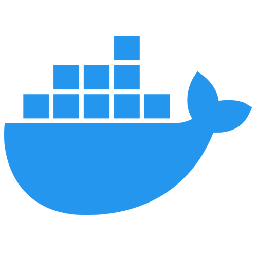
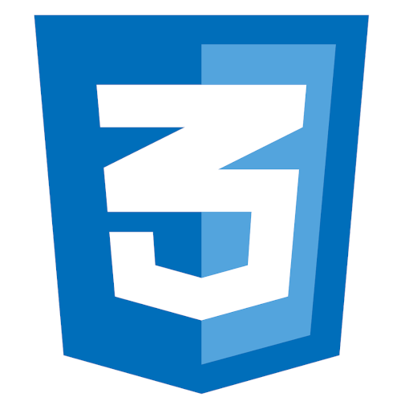
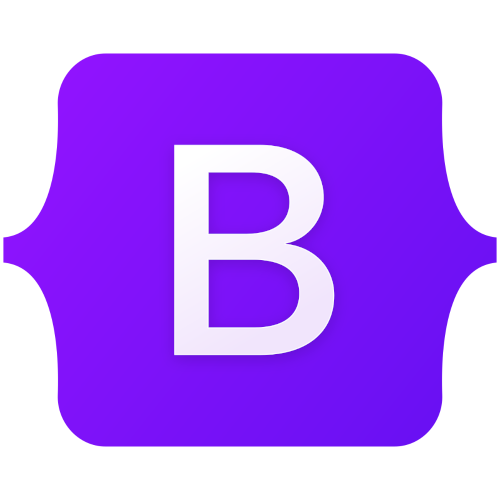
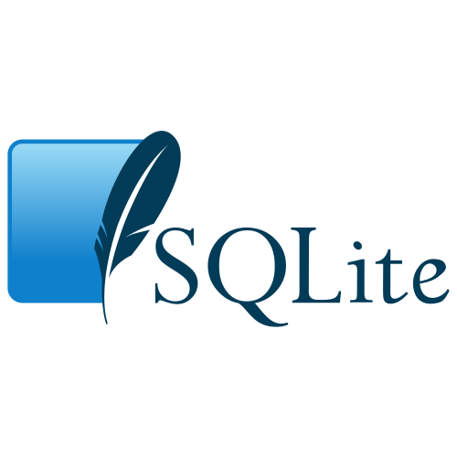
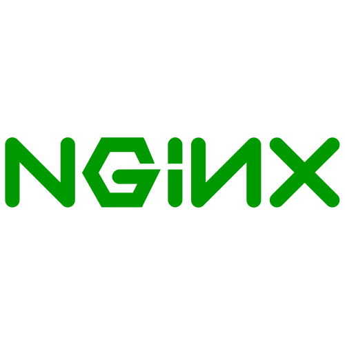

## Programming / IT

     

---

**Linux**: intermediate
- System management: installing Linux, configuring the system, handling updates through **apt**
- Identifying and solving problems by using **dmesg** and **journalctl**
- Creation and handling of user processes through **systemctl**
- Event scheduling through **crontab**
- Configuration and usage of **Raspberry Pi**s as servers
- Interaction with remote servers through **SSH**

---

**Python**: intermediate

**Git**: basics

**Visual Studio Code**: basics

---

**Docker**: basics
- Creation and handling of containers
- Basics of **Docker Compose** and of **Compose Watch**
- Creation of simple **Dockerfile**s

---

Computer building

## Web Development

           

---

Web Deployment through **Aruba VPS**

**DNS Record**s creation: basics
- Linking web domains to IP addresses of servers

---

**Javascript**: intermediate

**HTML**: advanced

**CSS**: advanced
- Custom CSS
- Bootstrap
- Tailwind

**Nodejs**: intermediate

**ExpressJs**: intermediate

---

**MySQL, SQLite, MongoDB**: basics
- CRUD
- User creation and privilege handling
- Automatic data insertion through scripts

---

**NGINX**: basics
- NGINX as a reverse proxy

---

Automatic testing with **Cypress**: basics

Creation of simple **REST APIs**

---

Inner structure and workings of HTTP requests:
- Usage of request headers to identify bots
- Cookies

---

Python-based websites:

**Flask**: basics

## Graphic Design / CGI / Marketing

    

---

**Blender**:
- Procedural shaders: intermediate
- Rendering of product mockups and packaging: basics

---

**GIMP**: advanced

**Photoshop**: intermediate

---

Video editing:

**Kdenlive**: intermediate

**Davinci Resolve**: basics

## Productivity Software

   

---

Microsoft **Word**: advanced

Microsoft **Excel**: intermediate

Microsoft **Powerpoint**: intermediate