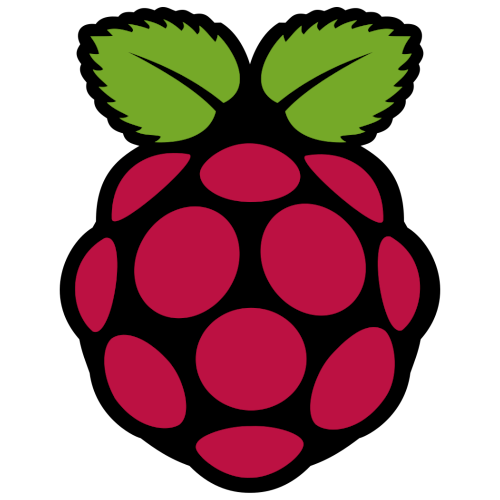
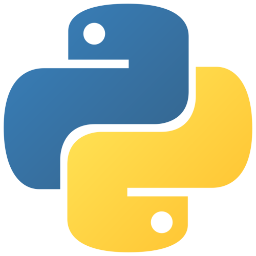
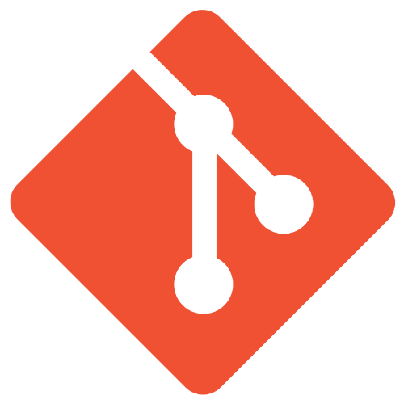
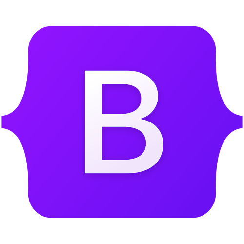
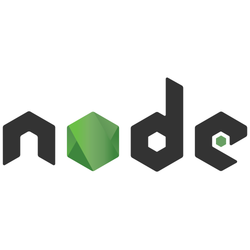
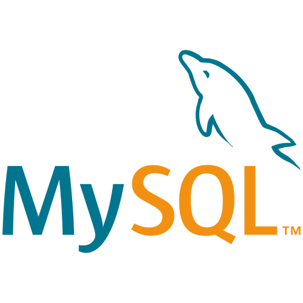
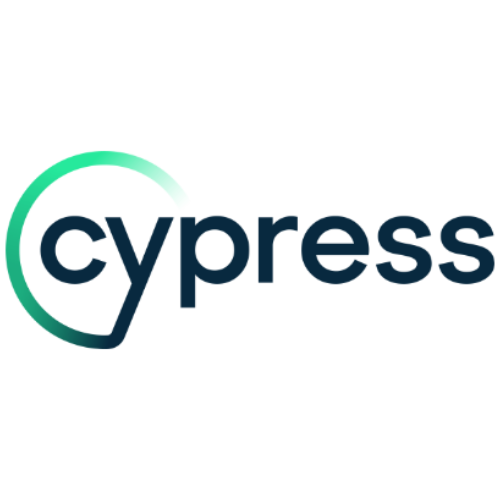

## Programmazione / IT

     

---

**Linux**: intermedio
- Gestione del sistema: installazione di Linux, configurazione del sistema, aggiornamenti tramite **apt**
- Utilizzare **dmesg** e **journalctl** per individuare e risolvere problemi
- Gestire e creare processi utente attraverso **systemctl**
- Programmazione di eventi con **crontab**
- Utilizzo di **Raspberry Pi** come server
- Interagire con server remoti tramite **SSH**

---

**Python**: intermedio

**Git**: basi

**Visual Studio Code**: basi

---

**Docker**: basi
- Creare e gestire container
- Basi di **Docker Compose** e di **Compose Watch**
- Creazione di semplici **Dockerfile**

---

Assemblaggio di computer

## Web Development

           

---

Web Deployment attraverso **Aruba VPS**

Creazione di **Record DNS**: basi
- Collegare domini web ad indirizzi IP di server

---

**Javascript**: intermedio

**HTML**: avanzato

**CSS**: avanzato
- Scrittura di CSS custom
- Bootstrap
- Tailwind

**Nodejs**: intermedio

**ExpressJs**: intermedio

---

**MySQL, SQLite, MongoDB**: basi
- CRUD
- Creare utenti e gestire privilegi
- Compilare tabelle di database in modo automatico attraverso script

---

**NGINX**: basi
- Utilizzo di NGINX come reverse proxy

---

Test automatici con **Cypress**: basi

Creazione di semplici **API REST**

---

Struttura e funzionamento delle richieste HTTP:
- Utilizzo degli header delle richieste per raccogliere dati sul traffico e per identificare bot
- Utilizzo dei cookie

---

Python per il web:

**Flask**: basi

## Graphic Design / CGI / Marketing

    

---

**Blender**:
- Shader procedurali: intermedio
- Mockup e render di packaging: basi

---

**GIMP**: avanzato

**Photoshop**: intermedio

---

Video editing:

**Kdenlive**: intermedio

**Davinci Resolve**: basi

## Productivity Software

   

---

Microsoft **Word**: avanzato

Microsoft **Excel**: intermedio

Microsoft **Powerpoint**: intermedio